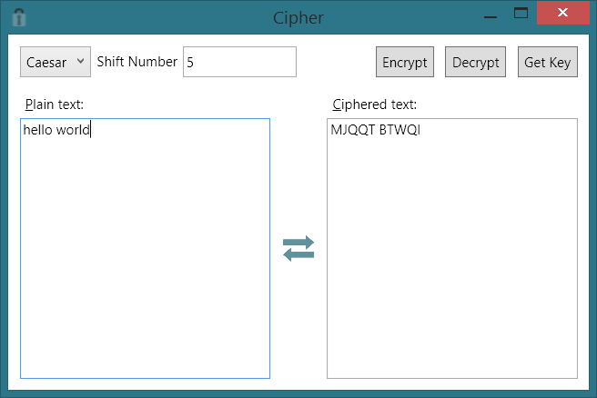

# Cipher

## Project Description
A simple substitution cipher tool. Ciphers text using a Caesar or Polyalphabetic cipher.

## Features:
* Caesar Cipher
* Polyalphabetic Cipher

## Requirements:
* Microsoft's .NET Framework 4.5 or later (comes with most Windows systems)

## Links:
* .NET Framework: [http://www.microsoft.com/en-us/download/details.aspx?id=40773](http://www.microsoft.com/en-us/download/details.aspx?id=40773)
